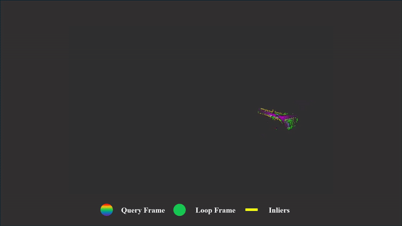

# FLASH
- TBA

---

# Dependencies
---

# Commands
---

# KITTI Demo
- Keyframe Interval = 3.0m, Positive Threshold = 10.0m
- 30 keyframes are excluded to avoid detecting near loop closures.
  
<table>
  <tr>
    <td width="50%">
      
    </td>
    <td width="50%">
      
    </td>
  </tr>
</table>
# Acknowledgments

